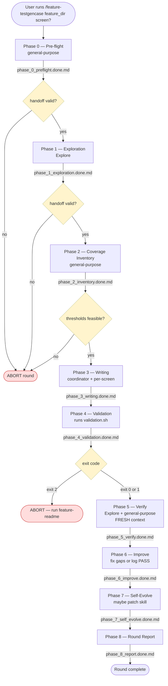

I don't remember exactly why, but a long time ago I was curious about the idea of programming my brain :D That stupid idea led me on the journey of reading the book "The Programmer's Brain" by Dr. Felienne Hermans. There are a lot of interesting things in the book, but the one I find the most interesting is the concept of three layers of memory: the Long-Term Memory, the Short-Term Memory, and the Working Memory. Today I want to talk about it because I found that it maps very well to the way I organize my knowledge and work with AI.

## TL;DR

Your brain ships with three layers of memory:

1. **Long-Term Memory:** the hard drive. Everything you ever learned: programming language, framework, that one bug from 2019. Store long time, but you need the right *keyword* to remind you. You lose 75% of what you read if you don't refresh it within 48 hours :D
2. **Short-Term Memory:** the RAM. Tiny. Holds maybe a dozen items: the current task, the goal of the feature, the conversation about what we need to clarify. Someone pings you on Slack? Switch to answer it and bingo, cache invalidated!!!. You need 23 minutes to warm it back to your head.
3. **Working Memory:** the CPU. The thing actually executing. You don't really observe it directly, but it's the bottleneck on what you can ship right now.

And what about LLMs?

1. **Long-Term Memory:** the training data, the parameters, the weights they have shipped with. If they is trained on Python, they definitely can do Python code. Cost too much to do fine-tuning for normal users.
2. **Short-Term Memory:** the context window. The system prompt, the user prompt, any skills or references you load into the context window. What will different performance between users.
3. **Working Memory:** the thinking process. The way the model calculates the next token prediction, the way it "thinks" about the task, and so on. Not really sure about this one yet, but I don't think we can optimize it at home.

What is a tip of the day now?

1. Store something that is fact, fundamental or lesson learned in the Long-Term Memory. Can be divide into personal-scope, company-scope, team-scope and project-scope. You know where you put it to get it back correctly.
2. Use **smart-routing** and **on-demand loading** to manage the Short-Term Memory. To loading Long-Term Memory into the Short-Term Memory, I suggest you use at least three layes of indexing: a category index to find the right category of information, a keyword index to find the right piece of information in that category, and a relevance index to rank the information based on the relevance to the task.
3. Make Assistant Diary, record every Assumption or Trade-Off the LLM Assistant makes when working on a task. Compact it every week and review what is worth to move to the Long-Term Memory, what is worth to keep in the Short-Term Memory, throw away the rest. 


## The Long-Term Memory

The Long-Term Memory works like a hard drive: it can store information for a long time and retrieve it when a trigger keyword is given.

For humans, it's the knowledge we have learned, the experience we have had, and the skills we have acquired. For example, we learned the concept of an if-else statement from the beginning of our programming journey, and we have been using it for years. It's a fundamental concept that we can easily retrieve from our Long-Term Memory whenever we see an if-else statement in the code. An example from mine is when I see the if-else-elif-fi statement of Bash, although it looks *weird* to me for the `fi` part, I can easily retrieve the concept of it from my Long-Term Memory and understand how it works.

For LLMs, the Long-Term Memory is the training data that it has been trained on, and the knowledge it has acquired from that data. When we give it a prompt, it can retrieve the relevant information from its Long-Term Memory based on the probability of next token prediction. The same thing happens to humans: we sometimes also need to *predict* what the context of the trigger keyword is to retrieve the right information. For example, when someone mentions "cache", I need to predict the context first. Are we talking about CPU cache, HTTP cache, browser cache, or content cache? Each one triggers a different chunk of my Long-Term Memory: cache lines and eviction policies for CPU, `Cache-Control` headers for HTTP, IndexedDB for browser, and TTL/keyspace for Redis. 

There are few things are worth to note about the Long-Term Memory of humans:

1. Although we can have the same knowledge about a thing, we can have different opinions about it. For example, we all know the concept of a for loop, but we may have different opinions about how to use it. Some like to use a raw for, some like to use foreach, and some like to use `for ... in ...`. I call it the `taste` of the developer, and it is what makes our code unique and different from others. Some `taste` is so good that it becomes a `convention`, `principle`, or `best practice` that many folks like to follow, but some `taste` is so bad that it becomes an `anti-pattern` that many people like to avoid.

2. The `taste` of a developer is the main reason why they like to use a specific programming language, framework, or tool. That's why we have plenty of programming languages, frameworks, and tools in the world, which somehow look similar but have unique things that make them different from others. For example, we have `React` and `Vue`, which serve the same purpose of building user interfaces, but with different syntax and working mechanisms. And how about jQuery? :D

3. Humans can only keep 25% of the information in the Long-Term Memory after 48 hours if they don't review it. The book Über das Gedächtnis (literally "On Memory", officially translated into English as Memory: A Contribution to Experimental Psychology) by Hermann Ebbinghaus says so.

## The Short-Term Memory

The Short-Term Memory works like a RAM: it store temporary information that we need to use in the near future, can store a few items but does not exceed a dozen. 

For humans, it's the `context` of what we are doing, the `goal` we want to achieve, the `problem` we want to solve, and so on. How many times have we been in a meeting where someone starts talking about something, and you are like "what the hell is he/she talking about?" because you don't have the context of what they are talking about. To actually contribute to the meeting, you have to pause them and ask for the context; that's when your Short-Term Memory of the problem is built up.

For LLMs, the Short-Term Memory is the `context window` that it can hold to work on the task, including the system prompt, the user prompt, the information we have given it, and the information it has generated.

If Long-Term Memory is the factor of how good you are at a specific topic, the Short-Term Memory is the factor of performance output you can produce on a given task. Knowing lots of things only guarantees you have enough information to work on the task; managing the Short-Term Memory is the key to actually producing something good.

Both humans and LLMs face the same problem when it comes to the Short-Term Memory: it is limited. How many times have we worked on a new project/problem/task that requires us to consume a lot of new concepts, which are not in our Long-Term Memory yet, then easily got overwhelmed and forgot the original goal of working on the project/problem/task? And from my experience with LLMs, some models easily get "overthinking" (aka hallucination) when the remaining context window gets too small.

There are few things to note about the Short-Term Memory:

1. For humans, context switching cost is a real thing. From a Software Engineer POV, context switching costs developers 23 minutes per interruption, according to "The Cost of Interrupted Work: More Speed and Stress" by Gloria Mark, Daniela Gudith, and Ulrich Klocke. That's why developers hate interruptions when they are working deeply on a task. I think everybody can relate to this, right? :D

2. Short-Term Memory will eventually write back to the Long-Term Memory if that information is repeatedly used. Humans do it automatically, but for LLMs, we need to explicitly tell it to do that by giving it a prompt like "remember this information for future use". 

## The Working Memory

The Working Memory works like a CPU: it's the information you held to work on it. You need to subtract two numbers? Then you need to remember what values they are, then do the subtraction, throw away them and only keep remembering the results. 

For humans, you are thinking about a problem, trying to do ping-pong solutioning, finding a good suite to start working. It all happens unconsciously in your head, and you don't even realize that you are doing it.

For LLMs, I'm not really sure what can map to the Working Memory, but I think it's the memory it uses to calculate the next token prediction, and maybe the "thinking" process providers advertise about.

Nothing to note because I don't really understand the Working Memory of LLMs yet, but I think it's an interesting topic to explore in the future.

## For Software Engineer

In this section, I will talk about the way I, a Software Engineer, work with the three layers of memory in the AI era.

First of all, the Long-Term Memory is the most important layer. I have been working as a Software Engineer for 10 years, and there are lots of things I would like to remember and ask a Coding Assistant to follow when I need them to work on a task. Up until now, designing an Agent Skill to manage the Long-Term Memory of a specific programming language, library, or framework is the most convenient way for me. 

For example, I designed a skill named `Senior Go` to work on any task related to the Go programming language. If you look at the entrypoint of the skill at [SKILL.MD](https://github.com/kanthorlabs/dotagents/blob/main/skills/seniorgo/SKILL.md), you can see I divided the memory into two parts: the `Always Loaded` and the `Deferred References`. Because of the limitation of the Short-Term Memory, I can't load all the information about the Go programming language into the context window of the LLM, so I need to prioritize what information is more important and should be loaded first, and what information is less important and can be loaded later when a keyword is triggered. It mirrors exactly how I work on a project: something pops out of my head when I read code, but some things take time to recall when I see a specific keyword.

The Long-Term Memory can not only be personal-scope, but also company-scope, team-scope or project-scope. All of them are represented by documents, by writing down notes, by sharing knowledge with others, and so on. 

Therefore, when working with a project, there is the order of how I load the memory into the context window of the LLM:

1. The personal-scope Long-Term Memory: the knowledge I have about the programming language, library, framework, and so on. And if I have a `taste` about how to use them, I also want to load that into the context window of the LLM, because it can help the LLM to generate code that is more consistent with my style and preference.

2. The company-scope, the team-scope, the project-scope, and the feature-scope Long-Term Memory: the knowledge about the project, the codebase, the architecture, the design patterns, and so on. Please note that the later scope in the list has higher priority than the former scope, and can override the former scope's decision when there is a conflict. If the company says we must do A/B testing for every change, but the feature says this one is small and can skip A/B testing, then I will follow the feature-scope memory and skip A/B testing for that change. Someone has to make the decision, right? :D

3. Not all agents deserve the full load of the Long-Term Memory, so the trick here is the way we give the LLM the prompt to allow it to load memory on-demand. For example, we have an orchestrator agent that spins up different agents to work on different tasks. The orchestrator needs the full load of the Long-Term Memory to make the decision about which agent to spin up, but the worker agent that actually works on the task only needs the relevant part of the Long-Term Memory to work. The sub-agent that works on Paywall doesn't need to know about the code at Onboarding, but it needs to know about the code at Lesson Learning because its task is about Lesson Limit. Fair, right? :D

Secondly, the game changer for me is the Short-Term Memory. For a complex task, Short-Term Memory (the context window of the LLM) is the key to success because if the LLM cannot handle the Short-Term Memory well, humans need to split the complex task into smaller sub-tasks that an agent can work on with proper performance output. Up until Anthropic Opus 4.6 with Claude Code (don't say anything about Opus 4.7 :D I have no comment about it, totally sad), it's the best Coding Assistant I have ever used, one that understands and works on a specific task with high accuracy. I followed the thinking process of the model and found out that it can find exact pieces of existing code or documents that are relevant to the task, which is a major factor in its performance. I tried to use OpenCode with Opus 4.6 and could simulate similar performance if I gave OpenCode the same relevant information that Claude Code can self-discover.

So as a Software Engineer, I often limit the scope of the task (aka complexity) based on the model I use. The metric I use to measure the complexity of the task is my estimation of how long it takes a Middle Engineer to finish it. I will give you an example of how I do it, with the mapping of Opus:Senior-Engineer and Sonnet:Middle-Engineer:

1. One-shot prompt on Opus and Sonnet: a small bug fix or change in less than 3 files is a task that a Middle Engineer can finish in 2 hours, including self-testing.
2. One-shot sub-agent on Opus and Sonnet: a change request on a specific feature that involves more than 3 files of editing, which can be finished in less than 4 hours, including self-testing.
3. Hand-off Protocol on multiple Opus and multiple Sonnet: a new feature or refactor that involves lots of decision making and needs weeks to finish.

The Hand-off Protocol is the really interesting one, because if you are working on a feature for weeks, you need to remember something for a long time, but you don't want to put it into your Long-Term Memory or the LLM's. You need to store it somewhere, then allow a sub-agent or yourself to retrieve it when you need it.

If you read my previous post about [Make an Agent Skill](/posts/make-an-agent-skill/), you will see that I designed a skill with a lot of references for different purposes as below

```bash
.agents/skills/feature-testgencase
├── SKILL.md
├── docs
│   ├── flowchart.md
│   └── orchestration.md
├── references
│   ├── ANALYTICS.md
│   ├── EXPLORATION.md
│   ├── HANDOFF.md
│   ├── IMPROVE.md
│   ├── INVENTORY.md
│   ├── ORCHESTRATION.md
│   ├── PAYWALL.md
│   ├── PREFLIGHT.md
│   ├── REPORT.md
│   ├── SELF_EVOLVE.md
│   ├── UI_ASSERTIONS.md
│   ├── VALIDATION.md
│   ├── VERIFY.md
│   ├── WRITING.md
│   └── feature-memory
│       ├── _TEMPLATE.md
│       └── <feature-specific-memory>.md
└── scripts
    └── validation.sh
```

And this is how it works



You can see that between each phase, there is a gate to check if the handoff is valid, or the thresholds are feasible, or the exit code is correct. The handoff is a markdown file about what a step has done, what the result is, and what the next step is. Depending on the task, the handoff can contain more information about what failed, what is missing, what is a blocker, and so on. 

As a human, at a high level you only need to check the handoff file to understand what is going on, and make a proper decision about how to fix things. Did I mention that the flow above is fully automated by the agent? :D So at the end of the day, I only need to check the handoff file of each phase to understand what the next action I need to do is. If something went wrong, I will prompt to fix it, re-run the phase, or even re-run the whole flow with additional information that fixes the handoff issue.

The skill itself also has a Long-Term Memory about a specific feature, which I can load into the context window of the LLM when I work on that feature. Otherwise, the common project-scope Long-Term Memory is loaded to perform the task. That Long-Term Memory is stored in `references/feature-memory/<feature-specific-memory>.md` and will be enhanced on every run of the skill. But periodically, I need to review the content and cut out redundant or outdated information to keep it clean and useful.

For Working Memory, I don't have a clear strategy to manage it yet, because how can I intercept the LLM thinking? But it's worth reading the LLM thinking because it's a good way to understand and make further optimizations on the Short-Term Memory management to make Working Memory more efficient. That's why your system works super powerfully on one model then suddenly becomes a stupid piece of **** when you switch to another model.

A note from me about model using experience:

- Opus, Sonnet, and Claude Code are the best combination for coding tasks now, not only for planning but also for execution. Excellent is the word to describe their performance, and I have no complaints about it.
- GPT-5.5 is a good model when you need creative discussion. Although Opus can also do it well, Opus is too focused on one thing; GPT-5.5 can sometimes give you new ideas that you don't know you don't know. I think training data is the reason behind it, but I have no evidence to support that claim :D This is a good example of how Long-Term Memory can affect the characteristics of a model when performing some `taste` works.
- Gemini-3 is good at exploring a specific topic, maybe because it inherits the strength of Google Search.

## Notes

2026-05-19: Ask Coding Assistant to write down every decision it makes weren't in the spec, things that it has to change, tradeoffs you have to make or anything else the human need to review. From that note, you can found out some interesting things about your working project that drives your Coding Assistant to write code that you don't like.

2026-05-20: Cooked the Assistant Diary plugin for Claude with name [kanthorjournald](https://github.com/kanthorlabs/dotagents/tree/main/.claude/plugins/kanthorjournald)