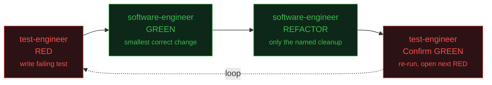
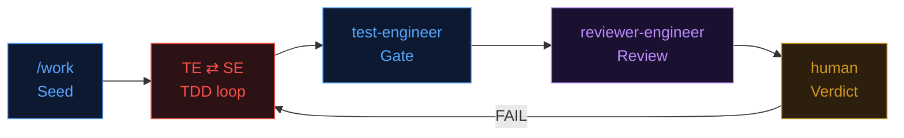

TL;DR: I built a multi-agent TDD workflow where three AI agents, test-engineer, software-engineer, reviewer-engineer, work in strict lanes, coordinated by an orchestrator command `/work`. No agent can mark its own work as correct. Quality comes from the protocol, not the model, so workers are swappable to budget models. Every guardrail in the system came from a real failure.

Disclaimer: the post was generated by AI agents, reviewed by a human, and edited. Don't judge the AI, judge the output.

## The project: KanthorVault

KanthorVault is a native Apple app (iOS + macOS) for securing family assets, documents, photos, and contacts with end-to-end encryption tied to a trusted Apple account. Think of it as a personal vault for things that aren't just files, they're your legacy.

The codebase is a single Xcode project with three layers: `shared/` (domain models, services, view models), `ios/` (iPhone/iPad UI), and `macos/` (Mac UI). Each platform has its own test targets (`iosTests/`, `iosUITests/`, `macosTests/`, `macosUITests/`). Work is planned as EPICs (one per screen or feature), broken into Stories (per platform), then into Tasks (one TDD cycle each).

I built the entire app using AI coding assistants. The workflow described in this post is how I coordinated multiple AI agents to do it, and every example, failure, and commit SHA comes from this project.

## The direction: everybody will become an Engineering Manager

I started this experiment with two premises:

**Premise 1: I'm an Engineering Manager.** I review plans, acceptance criteria, and verdicts, not every line of every view. Code that reaches me is already tested, built, and reviewed. Only get the hand dirty for critical code.

**Premise 2: A raw model is a candidate, not a hire.** You customize it: a persona defines its role, gotcha files carry lessons learned, conventions set the guardrails. `.claude/agents/*.md` = job descriptions. `.agents/memory/*.md` = onboarding docs. `CLAUDE.md` = team conventions. Coding Assistant is exactly the case that you hire someone for you team, train them on your codebase and standards, and then let them do their job. The better the training, the better the work, but the protocol is what ensures quality.

The rule is simple: split roles, enforce lanes, require proof at every handoff. Run it like a team, not a tool.

## The core idea: one contract, three roles

No agent can mark its own work as correct. Every claim is checked by a different role.

| Role | Tag | Job |
|---|---|---|
| `test-engineer` | Verify | Writes the failing test first. Only role that runs tests. |
| `software-engineer` | Do | Smallest change to pass the test, then the named refactor. Never runs tests, never touches test files. |
| `reviewer-engineer` | Review | Read-only, runs post-cycle. Catches concurrency bugs, gotcha violations, AC gaps. Every finding must cite a source. |

Three hard rules enforce separation:
- **No self-shaped tests**, test written before implementation.
- **No "fixing the test"**, implementer can't touch test files.
- **Lanes enforced by git diff**, out-of-lane writes abort the turn.

## The `/work` orchestrator

The `/work` command drives the whole cycle. It alternates agents, checks every turn, and hands off to the human when needed. It never writes code itself.

```bash
# Drive a full TDD cycle for one EPIC
/work .agents/plan/v1/mvp/epics/003-capture-a-thing.md

# Platform-scoped, in an isolated git worktree (parallel iOS + macOS)
/work <epic> --platform ios --base work/003-shared

# Merge both platform branches + run the full gate on BOTH schemes
/work <epic> --join --base work/003-shared
```

The orchestrator enforces four things:

1. **Turn verification**, After each dispatch, check the discussion file. No change = abort.
2. **Lane ownership check**, Git diff before/after each turn. Wrong files touched = lane violation, abort.
3. **Three-strikes escalation**, Three `ATTEMPT-FAILED:` on the same Task = loop stops, escalates to human.
4. **Human-gated closure**, Only `HUMAN_REVIEW: PASS` closes an EPIC. Agents suggest, human decides.

## The TDD heartbeat: RED -> GREEN -> REFACTOR -> Confirm

Each Task runs one TDD cycle. The test-engineer owns both ends, the software-engineer owns the middle. The orchestrator alternates based on the last `END:` marker.



Both sides must prove their work:
- **SE claims verified by build**, `verify-build.sh` output (build + lint) attached before handoff.
- **TE claims verified by test results**, RED proof (correct assertion fails) before handoff, GREEN proof (test passes) after SE's fix.

Platform Tasks covered by shared tests can skip RED, TE forwards a pass-through, SE implements, TE runs build-only check.

## The discussion file: how agents coordinate

Agents never talk directly. One markdown file per EPIC scope, append-only via `cat >>`. Platform mode uses suffixed files (`-shared`, `-ios`, `-macos`, `-join`), so parallel cycles do not write to the same file.

```markdown
.agents/debate/history/2026-06-04-003-capture-a-thing.md

## TEST-ENGINEER — capture-vm · RED for Task 003-capture-save
**RED proof.** exit 65 · "Expectation failed: (sut.items.count → 0) == 1"
END: TEST-ENGINEER

## SOFTWARE-ENGINEER — capture-vm · GREEN+REFACTOR
**Build check.** ios: exit 0 · log: .build-check-ios.log
END: SOFTWARE-ENGINEER

IMPLEMENTATION_READY_FOR_REVIEW:   ← /work greps this to stop the loop
HUMAN_REVIEW: PASS                 ← the human's verdict IS the closing record
```

Three properties make this work:
- **Resumable**, re-run `/work` anytime; it reads the tail and continues.
- **Auditable**, every turn, proof, and verdict is on the record.
- **Race-safe**, append-only writes and orchestrator-created turn IDs.

## Three strikes: bounded retries

Each failed attempt is a greppable `ATTEMPT-FAILED: <task-id>` line. At three, the loop stops and the human takes over.

```
ESCALATE TO HUMAN — task 003-capture-save failed 3 attempts and cannot self-resolve.
The TDD loop is paused at turn 17. Review the discussion file, resolve the blocker,
and re-run /work to resume.
```

What counts as a failed attempt: an `OPEN:` blocker, or a confirm-GREEN turn that finds the test still red. Counts reset per review cycle, reopened Tasks don't inherit old failures. GREEN Tasks stop emitting the line, so only truly stuck Tasks reach three.

## The TDD pair: mirrored lanes, hard boundary

TE says _what_, SE decides _how_. Crossing the line either way is a blocking error.

**test-engineer (Verify)**
- Opens and closes every cycle, only role that runs tests
- Lane: test targets plus test identifiers (`iosUITests/`, `macosUITests/`, `iosUITests/TestID.swift`, `macosUITests/TestID.swift`)
- Asserted strings must match mockup verbatim
- Tests user-observable behavior, not internal state
- RED before handoff, GREEN after SE changes
- Signals `IMPLEMENTATION_READY_FOR_REVIEW` when gate is green

**software-engineer (Do)**
- GREEN: smallest correct change. REFACTOR: only the named cleanup
- Lane: `shared/`, `ios/`, `macos/`, never test targets
- Owns all design decisions
- Every changed line traces to the failing test or named refactor
- `verify-build.sh` must pass before handoff
- Pushes back via `OPEN:`, never silently changes the contract

## The reviewer-engineer: read-only, citation-backed

Runs after `IMPLEMENTATION_READY_FOR_REVIEW`. Reviews changed files against documented standards. Read-only, describes fixes, never applies them.

| Dimension | Checks | Every finding must cite |
|---|---|---|
| Correctness | Does the code satisfy every acceptance criterion? | The specific AC line in the Story file |
| Concurrency | `@Observable`, `@MainActor`, nonisolated misuse | The exact `swift-6.md` gotcha section |
| Test quality | Silent fallbacks, vacuous tests, missing edges | `swift-testing.md` section |
| API design | Will iOS/macOS layers consume this cleanly? | The consumer that will be hurt |
| Simplicity | Over-abstraction, speculative patterns, dead code | The simpler equivalent alternative |
| Security | Vault-specific: secrets in UserDefaults, log leaks, file protection | The data-handling rule violated |

**BLOCKER** = must fix. **SUGGESTION** = nice to have. No citation = finding gets dropped.

## Full lifecycle: one EPIC, start to finish



On `HUMAN_REVIEW: FAIL`, each `BLOCKER:` goes back through the TDD loop, TE writes a regression test, SE fixes it, cycle re-gates. For parallel platforms: shared first, then `--platform ios` and `--platform macos` in parallel worktrees, then `--join` merges and gates both.

## EPICs aren't waterfalls, going back is a feature

State lives in per-EPIC discussion files. Any EPIC can be reopened without affecting others. A real example from KanthorVault:

1. EPIC 002.2 ships, `HUMAN_REVIEW: PASS`. Gate green on both platforms, reviewed and accepted.
2. EPIC 003 starts, new discussion file, fresh loop. 002.2 untouched.
3. 003's work exposes issues in 002.2, new UI flows surface gaps in earlier work.
4. Go back: blockers recorded against 002.2, cycle reopened. Regression tests first, then fixes through RED -> GREEN.
5. 002.2 re-passes, resume 003 where it left off. `/work` reads the tail and continues.

## Trade-offs, with evidence

This approach is slower and costs more tokens than a single-agent workflow. At least 3 agent turns per Task, and each turn re-reads the EPIC, Story, and discussion file.

The trade-off is that quality is in the protocol, not the model, so worker agents can run on cheaper models. Git history shows the model changes:

```
$ git log -- .opencode/agent/software-engineer.md
73f25b0 2026-06-03  model: github-copilot/gpt-5.5
e813f9c 2026-06-01  model: opencode/minimax-m3-free      ← EPIC 002.2 closed HUMAN_REVIEW: PASS
0e1a47a 2026-05-27  model: opencode-go/qwen3.7-max
463563b 2026-05-26  model: opencode-go/qwen3.6-plus
e3532c0 2026-05-26  model: anthropic/claude-sonnet-4-6

$ git show e3532c0:.opencode/agent/ceo.md | grep model:
model: opencode-go/deepseek-v4-pro                       ← DeepSeek ran the ceo + cto planners
```

Workers are swappable, one line of frontmatter per role. The protocol carries the quality.

## Lessons learned: every guardrail came from a real failure

Budget models broke things in specific ways. Each break became a protocol rule.

**Lesson 1: GLM taught the retry limit.** GLM as a worker retried the same Task forever with no exit. That's where bounded retries came from: 3x `ATTEMPT-FAILED:` per Task, then escalate to human.

**Lesson 2: Qwen + DeepSeek created the reviewer.** Qwen 3.6/3.7 + DeepSeek V4 Pro failed often. Every failure went to the human. Human review became the bottleneck. So `reviewer-engineer` was born as a pre-review gate: BLOCKER/SUGGESTION with citations, before the human sees anything. First commit: May 29 (`92da13c`), right after the Qwen/DeepSeek era.

The takeaway: weak models expose protocol gaps fast. Fix the protocol, and every model benefits.

## What actually helped

**Make models review each other.** Write with model A, save to file, ask model B to review it. Then ask A: "anything you want to push back on?" This deck: Claude Opus wrote it, Codex reviewed it, found 3 factual errors the author missed.

**Find a workflow, then write it down.** Use cross-model review to explore how you want to work. Try things, keep what sticks. EPIC -> Story -> Task came from this. Simple enough that agents follow it, flexible enough to change mid-cycle.

**Do it the dumb way first.** Don't optimize at the start. Do it manually, notice what hurts, fix that specific thing. Bounded retries, the reviewer role, parallel worktrees, all came from hitting the same problem twice, not from planning ahead.

**Make the model log its decisions.** Have the agent write down every tradeoff, assumption, and off-spec decision it made per turn. Read those logs. They show you where the agent guesses, where it wastes effort, and where the spec is ambiguous. That's your optimization surface.
